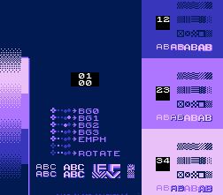

# NES Palette Test

Something I whipped up to help me make an NES palette that matches my particular CRT.

Built using [NESfab](https://github.com/pubby/nesfab). Can be compied by calling `nesfab paltest.cfg`. 
